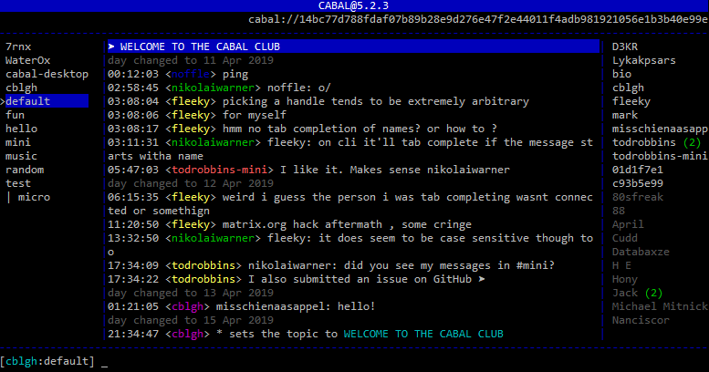

# cabal-cli

> Terminal client for cabal, the p2p chat platform.

See [cabal-core](https://github.com/cabal-club/cabal-core) for the underlying
database & api.



chat with us:  
`npx cabal cabal://cabal-club.github.io`

## Installation

```
$ npm install --global cabal
$ cabal --new 
```

## Usage
#### Start a new instance:
```
cabal --new
```

#### Connect to an existing instance:
```
cabal --key <key>
```
e.g.
```
cabal --key cabal://0201400f1aa2e3076a3f17f4521b2cc41e258c446cdaa44742afe6e1b9fd5f82
```

#### Headless mode

This will run cabal without a UI. You can use this to seed a cabal (e.g. on a VPS) and make its data more available:
```
cabal --key <key> --seed
```

## Commands
```py
/add, /cabal
  add a cabal
/new
  create a new cabal
/nick, /n
  change your display name
/emote, /me
  write an old-school text emote
/names
  display the names of the currently online peers
/channels
  display the cabal's channels
/panes
  set pane to navigate up and down in panes: channels, cabals
/join, /j
  join a new channel
/leave, /l
  leave a channel
/clear
  clear the current backscroll
/help
  display this help message
/quit, /exit
  exit the cabal process
/topic, /motd
  set the topic/description/message of the day for a channel
/whoami, /key
  display your local user key
/whois
  display the public keys associated with the passed in nick

alt-n
  move between channels/cabals panes
ctrl+{n,p}
  move up/down channels/cabals
```

## Hotkeys
`ctrl+u`  
&nbsp;&nbsp;&nbsp;&nbsp;clear input line  
`ctrl+w`  
&nbsp;&nbsp;&nbsp;&nbsp;delete last word in input  
`up-arrow`  
&nbsp;&nbsp;&nbsp;&nbsp;cycle through command history  
`down-arrow`  
&nbsp;&nbsp;&nbsp;&nbsp;cycle through command history  
`home`  
&nbsp;&nbsp;&nbsp;&nbsp;go to start of input line  
`end`  
&nbsp;&nbsp;&nbsp;&nbsp;go to end of input line  
`ctrl+n`  
&nbsp;&nbsp;&nbsp;&nbsp;go to next channel  
`ctrl+p`  
&nbsp;&nbsp;&nbsp;&nbsp;go to previous channel  
`pageup`  
&nbsp;&nbsp;&nbsp;&nbsp;scroll up through backlog  
`pagedown`  
&nbsp;&nbsp;&nbsp;&nbsp;scroll down through backlog  
`alt-[1,9]`  
&nbsp;&nbsp;&nbsp;&nbsp;select channels  1-9  
`alt-n`  
&nbsp;&nbsp;&nbsp;&nbsp;tab between the cabals & channels panes 
